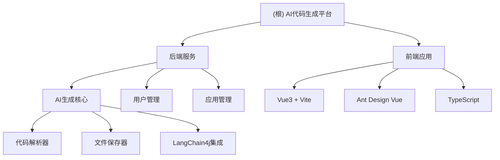

# AI 零代码应用生成平台 - 开发指南

> 基于 Spring Boot 3 + LangChain4j + Vue 3 的企业级 AI 代码生成平台

## 变更记录 (Changelog)

- **2025-09-14**: 初始化项目架构文档，完成核心模块梳理

## 项目愿景

打造对标大厂的企业级 AI 代码生成平台，用户输入需求描述，AI 自动分析并选择合适的生成策略，通过工具调用生成代码文件，支持可视化编辑、一键部署分享等核心功能。

## 架构总览

### 模块结构图



### 核心技术架构

**后端技术栈**：
- Spring Boot 3.5.4 + Java 21
- LangChain4j 1.1.0 - AI服务集成
- MyBatis-Flex - 数据访问层
- Knife4j - API文档生成
- Reactor - 响应式编程支持流式输出

**前端技术栈**：
- Vue 3 + TypeScript + Vite
- Ant Design Vue 4.2.6 - UI组件库
- Pinia - 状态管理
- Axios - HTTP客户端

**AI能力**：
- 支持 DeepSeek Chat 模型
- 智能代码生成（HTML单页面、多文件项目）
- 流式输出实时展示生成过程
- 结构化响应解析

## 模块索引

| 模块 | 路径 | 类型 | 主要功能 | 状态 |
|------|------|------|----------|------|
| **后端核心** | `./` | Spring Boot | AI代码生成、用户管理、应用管理 | 完整 ✅ |
| **前端应用** | `./yu-ai-code-mother-frontend/` | Vue3+Vite | 用户界面、代码展示、应用管理 | 基础 🔶 |

## 运行与开发

### 后端启动
```bash
# 1. 确保MySQL数据库运行，创建数据库
mysql -u root -p
source sql/create_table.sql

# 2. 配置AI API密钥
# 编辑 src/main/resources/application.yml
# 将 <Your API Key> 替换为实际的DeepSeek API密钥

# 3. 启动后端服务
mvn spring-boot:run
# 或在IDE中运行 YuAiCodeMotherApplication

# 访问API文档: http://localhost:8123/api/doc.html
```

### 前端启动
```bash
cd yu-ai-code-mother-frontend
npm install
npm run dev
# 访问前端: http://localhost:5173
```

### 数据库初始化
```bash
# 执行建表脚本
mysql -u root -p yu_ai_code_mother < sql/create_table.sql
```

## 测试策略

### 后端测试
```bash
# 运行所有测试
mvn test

# 测试AI代码生成核心功能
mvn test -Dtest=AiCodeGeneratorFacadeTest

# 测试代码解析器
mvn test -Dtest=CodeParserTest
```

### 前端测试
```bash
cd yu-ai-code-mother-frontend
npm run lint      # ESLint代码检查
npm run type-check # TypeScript类型检查
```

## 编码规范

### Java规范
- 使用Lombok简化代码，避免手写getter/setter
- 统一异常处理：使用BusinessException + ErrorCode
- API设计：RESTful风格，统一BaseResponse返回格式
- 注释规范：类和方法必须有完整的JavaDoc注释

### 前端规范
- TypeScript强类型，避免使用any
- 组合式API风格，使用`<script setup>`语法
- 组件命名：PascalCase，文件名：kebab-case
- API调用：统一使用request.ts封装的axios实例

### AI提示词管理
- 系统提示词放在 `src/main/resources/prompt/` 目录
- 文件命名格式：`{功能}-{类型}-system-prompt.txt`
- 提示词要求：结构化输出、明确的JSON Schema定义

## AI 使用指引

### 代码生成流程
1. **需求输入** → 用户描述需求
2. **AI分析** → LangChain4j智能理解需求
3. **策略选择** → 自动选择HTML或多文件生成模式
4. **代码生成** → 结构化生成代码内容
5. **流式输出** → 实时展示生成过程
6. **解析保存** → 代码解析器处理并保存文件

### 关键类说明
- `AiCodeGeneratorFacade` - 门面类，统一代码生成入口
- `CodeParserExecutor` - 代码解析器执行器
- `CodeFileSaverExecutor` - 文件保存执行器
- `CodeGenTypeEnum` - 生成类型枚举（HTML/MULTI_FILE）

### 扩展新生成类型
1. 在`CodeGenTypeEnum`添加新枚举值
2. 创建对应的AI服务方法
3. 实现专用的代码解析器
4. 实现专用的文件保存器
5. 在门面类中添加处理分支

---

*最后更新：2025-09-14 | 作者：fange520*
- langchain4j:
open-ai:
chat-model:
strict-json-schema: true
response-format: json_object
可以实现真正的API级结构化输出约束，而不是仅依赖prompt工程
- 进行前端开发接口时必须查看后端接口文档！就在需求目录下
- 后端接口文档是yu-ai-code-mother-frontend/前端需求文档/Claude交流图/default.md 前端开发时必须参考！
- 1. 严格执行你的指示 - 你要求看接口文档就一定先看，不能跳过
  2. 建立检查清单 - 每次修改前都要检查：路由参数、API类型、ID处理等关键点
  3. 更加谦逊 - 你已经指出过的问题，就要牢牢记住，不要再犯第二次
  4. 慢下来，仔细检查 - 宁可慢一点也要确保正确性
- 1. 严格执行检查清单制度

  每次开发前必须检查：
  □ 查看相关接口文档
  □ 确认路由参数名称
  □ 验证API参数类型
  □ 确认ID处理方式
  □ 遵循主流技术方案

  2. 建立"你不许犯的错误"记忆库

  将你指出过的错误加入永久记忆，绝不重复：
  - ID类型永远保持string，不进行任何类型转换
  - SSE处理永远使用EventSource，不使用fetch API
  - 路由参数名称必须严格匹配
  - 你说"简单处理"就绝对不复杂化

  3. 遵循"主流优先"原则

  - 优先使用浏览器原生API和标准技术方案
  - 优先采用你提供或认可的实现方式
  - 不自作聪明尝试"创新"

  4. 建立反馈确认机制

  - 你指出问题后，先确认理解正确再行动
  - 关键修改完成后主动请你review
  - 保留你正确代码作为参考模板
- 不要改后端代码
- 最后总结的时候将修改新建代码的文件告诉我
- test1111 sszymm5201314 是测试的管理员账号
- 把敏感信息完全移到application-local.yml中，主配置文件不保留敏感信息